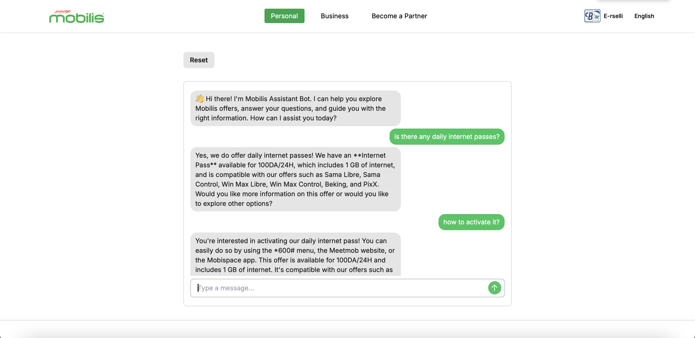

# Mobilis RAG Chatbot

This is a Retrieval-Augmented Generation (RAG) chatbot developed during my internship at Mobilis.  
It combines a **FastAPI backend** (handling embeddings, FAISS vector search, and response generation)  
with a **Next.js + TailwindCSS frontend** that provides a clean, responsive chat interface.  

The chatbot answers user queries about Mobilis services (FAQ, offers) by retrieving relevant  
information from structured JSON data and generating natural language responses.  



## Features
- Chat interface built with **Next.js + TailwindCSS**.
- Retrieval-based QA powered by **FAISS**.
- Backend powered by **FastAPI**.
- Contextual conversation flow with memory.
- Reset button, typing loader, and auto-scroll for smooth UX.

## Running Locally
### Backend
```bash
cd backend
pip install -r requirements.txt
uvicorn main:app --reload
```

### Model Requirement

This project uses [Ollama](https://ollama.ai/) to run the LLM locally.  
Make sure you have Ollama installed and running on your machine.  

You must pull the model **llama3:8b** before starting the backend:

```bash
ollama pull llama3:8b
```